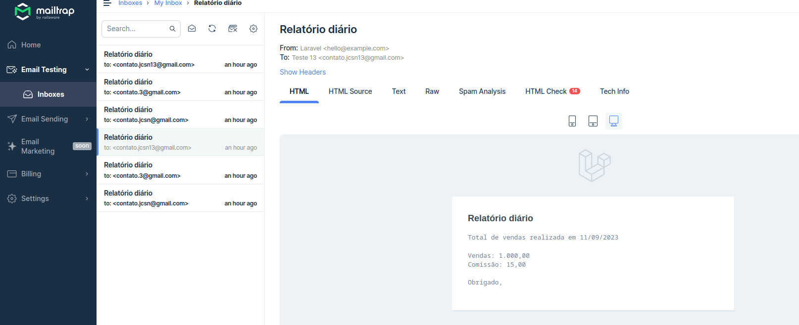

# Setup Docker

### Passo a passo
Clone Repositório
```sh
git clone https://github.com/juliocsnascimento/teste-api-vendas.git
```

Suba os containers do projeto
```sh
cd teste-api-vendas && docker-compose up -d
```

Acessar o container
```sh
docker-compose exec app bash
```

# API

Criar o arquivo de configuração
```sh
cd /var/www/api && cp .env.example .env
```

Atualize as variáveis de ambiente do arquivo .env
```dosini
DB_CONNECTION=mysql
DB_HOST=db
DB_PORT=3306
DB_DATABASE=tray
DB_USERNAME=devuser
DB_PASSWORD=dev123456

```

Instalação
```sh
cd /var/www/api && composer install && php artisan key:generate && php artisan migrate
```

Acessar o projeto
[http://localhost:8080](http://localhost:8080)

## APP

Criar o arquivo de configuração
```sh
cd /var/www/app && cp .env.example .env
```

Instalação
```sh
cd /var/www/app && composer install && php artisan key:generate
```

Acessar o projeto
[http://localhost:8081](http://localhost:8081)


# Envio de relatório e-mail

Está configurado para envio todos os dias às 18:00 

É necessário configurar os dados de SMTP

```sh
MAIL_MAILER=smtp
MAIL_HOST=sandbox.smtp.mailtrap.io
MAIL_PORT=2525
MAIL_USERNAME=6f00260be73937
MAIL_PASSWORD=4f1b83f95d3d5a
MAIL_ENCRYPTION=tls
MAIL_FROM_ADDRESS="hello@example.com"
MAIL_FROM_NAME="${APP_NAME}"
```

Para executar o comando dentro do container
```sh
cd /var/www/api && php artisan schedule:run
```

Outra configuração necessário é a configuração do crontab no linux

```sh
* * * * * php artisan schedule:run >> /dev/null 2>&1
```

Modelo de envio do e-mail

